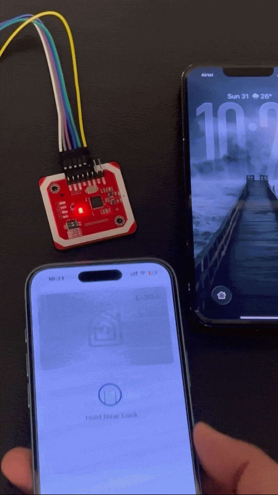

# 🔐⚡ Apple HomeKey Emulation (Zero-Latency NFC Access)

> An enterprise-grade, custom-engineered secure access control system that natively interacts with Apple Wallet executing cryptographic validation and triggering physical relays in under 150 milliseconds.


---

<table>
<tr>
<td width="20%">

</td>
<td width="50%">

## 📖 Overview

A **fully custom-built secure access control system** designed and engineered from the ground up to replicate the Apple Home Key experience without relying on any proprietary lock hardware, third-party cloud services, or licensed MFi integrations.

The system utilizes **Enhanced Contactless Polling (ECP)** concepts to natively interact with Apple Wallet credentials stored on iOS and watchOS devices. When an iPhone or Apple Watch is tapped against the reader, the PN532 module initiates an **ISO/IEC 14443 Type A** NFC transaction over SPI, reads the secure payload, performs **cryptographic hash validation** against a locally stored credential database, and triggers a physical relay all executing in **under 150 milliseconds** from tap to unlock.

</td>
</tr>
</table>

## 🏗️ System Architecture & Security

<table>
<tr>
<td width="50%">

### 🛡️ Protocol Emulation & NFC Handshake

The system operates at the **ISO/IEC 14443 Type A** standard level the same contactless communication protocol used by Apple Pay, transit cards, and secure access badges. The PN532 NFC/RFID module acts as a **target reader**, broadcasting a polling field that iOS and watchOS devices recognize as a valid Home Key-compatible endpoint.

When a device enters the reader's field, the following sequence executes:

1. **Anti-Collision Resolution** The PN532 resolves collisions if multiple NFC targets are present, isolating a single UID.
2. **ATS (Answer to Select)** The selected device responds with its capability set, confirming ISO 14443-4 compliance.
3. **Secure Payload Exchange** An APDU (Application Protocol Data Unit) command is issued to read the encrypted credential payload from the device's Secure Element.
4. **Cryptographic Validation** The received payload is hashed using SHA-256 and compared against the locally stored authorized credential table.
5. **Access Decision** Match triggers relay + LED confirmation. Mismatch triggers denial LED sequence and optional MQTT alert.

The entire handshake from field detection to relay trigger completes in **under 150ms**.

</td>
<td width="50%">

### ⚡ Hardware Interrupt Architecture
```
┌───────────────────────────────────────────┐
│              ESP32 (Main MCU)             │
│                                           │
│  ┌─────────────────────────────────────┐  │
│  │      IRAM_ATTR ISR Handler          │  │
│  │  (Pinned to IRAM zero flash         │  │
│  │   latency on trigger)               │  │
│  └──────────────┬──────────────────────┘  │
│                 │ GPIO Interrupt          │
│                 │ (Rising Edge)           │
│  ┌──────────────┴──────────────────────┐  │
│  │        PN532 IRQ Pin → GPIO         │  │
│  │  (Hardware interrupt, no polling)   │  │
│  └──────────────┬──────────────────────┘  │
│                 │                         │
│  ┌──────────────┴──────────────────────┐  │
│  │         SPI Bus (Full Duplex)       │  │
│  │  MOSI / MISO / SCK / SS             │  │
│  │  Clock: 1MHz noise-optimized        │  │
│  └──────────────┬──────────────────────┘  │
│                 │                         │
│  ┌──────────────┴──────────────────────┐  │
│  │       Response Pipeline             │  │
│  │  ├── SHA-256 Hash Validation        │  │
│  │  ├── Relay Trigger (GPIO)           │  │
│  │  ├── LED Ring Feedback              │  │
│  │  └── MQTT Status Publish            │  │
│  └─────────────────────────────────────┘  │
└───────────────────────────────────────────┘
```

Traditional NFC implementations use **software polling loops** continuously querying the PN532 in a blocking `while(true)` cycle, wasting CPU cycles and introducing unpredictable latency. This system **abandons polling entirely** in favor of `IRAM_ATTR` hardware interrupts on the ESP32.

The PN532's IRQ pin is wired directly to a GPIO configured as a **rising-edge hardware interrupt**. The ISR (Interrupt Service Routine) is decorated with `IRAM_ATTR`, ensuring it executes from **internal RAM** instead of flash eliminating the cache-miss penalty that flash-based ISRs incur. The result: deterministic, sub-microsecond response to NFC field events.

</td>
</tr>
</table>


---

## 🛠️ Hardware Bill of Materials (BOM)

| # | Component | Description | Qty |
| :---: | :--- | :--- | :---: |
| 1 | **ESP32 DevKit V1** | Main processing unit runs the NFC handshake state machine, cryptographic validation, relay control, LED feedback, and MQTT reporting. Dual-core 240MHz with hardware crypto acceleration. | 1 |
| 2 | **PN532 NFC/RFID Module** | ISO/IEC 14443 Type A/B compliant NFC transceiver communicates with the ESP32 over **SPI** at 1MHz for maximum throughput and minimum latency. Reads secure payloads from Apple Wallet, transit cards, and MIFARE credentials. | 1 |
| 3 | **5V Relay Module** | Optocoupler-isolated relay drives the electronic door strike or magnetic lock. Triggered by GPIO with a configurable hold duration and automatic safety cutoff. | 1 |
| 4 | **Custom 3D Printed Housing** | Designed from scratch in CAD flush-mount enclosure with a recessed NFC antenna window, ventilation channels, and snap-fit rear access panel. Printed in PLA with tuned wall thickness for RF transparency. | 1 |
| 5 | **WS2812B LED Status Ring (12x)** | Individually addressable RGB LED ring provides animated visual feedback: green sweep on successful auth, red pulse on denial, amber breathing during standby. | 1 |
| 6 | **3.3V LDO Voltage Regulator** | Clean 3.3V rail for the PN532 decoupled from the ESP32's onboard regulator to prevent SPI bus noise from digital switching transients. | 1 |
| 7 | **Logic Level Shifter (3.3V ↔ 5V)** | Bidirectional level translator for the relay control line and LED data pin ensures clean signal transitions without voltage sag or ringing. | 1 |

---

## 💻 Core Logic Asynchronous Interrupt & Payload Validation

> C++ firmware running bare-metal on the ESP32 hardware interrupts, SPI transactions, and SHA-256 hashing with zero polling overhead.

```cpp
#include <SPI.h>
#include <PN532_SPI.h>
#include <PN532.h>
#include <mbedtls/sha256.h>

// ── Pin Definitions ──────────────────────────────────────────────
#define PN532_SS_PIN     5         // SPI Chip Select
#define PN532_IRQ_PIN    4         // Hardware interrupt from PN532
#define RELAY_PIN        16        // Door strike relay
#define LED_DATA_PIN     27        // WS2812B status ring
#define RELAY_HOLD_MS    3000      // Lock open duration (ms)

// ── Globals ──────────────────────────────────────────────────────
PN532_SPI pn532spi(SPI, PN532_SS_PIN);
PN532 nfc(pn532spi);

volatile bool nfcInterruptTriggered = false;

// ── Authorized Credential Hashes (SHA-256) ──────────────────────
// Stored locally never transmitted, never cloud-synced
const char* authorizedHashes[] = {
    "a1b2c3d4e5f6...your_sha256_hash_here...",
    "f6e5d4c3b2a1...another_authorized_hash...",
    // Add additional authorized credentials here
};
const int NUM_AUTHORIZED = sizeof(authorizedHashes) / sizeof(authorizedHashes[0]);

// ── IRAM_ATTR Hardware ISR ──────────────────────────────────────
// Executes from internal RAM zero flash-read latency on trigger.
// Sets a volatile flag that the main loop services immediately.
void IRAM_ATTR onNfcInterrupt() {
    nfcInterruptTriggered = true;
}


// ── SHA-256 Payload Hashing ─────────────────────────────────────
String hashPayload(uint8_t* data, size_t length) {
    uint8_t hash[32];
    mbedtls_sha256_context ctx;
    mbedtls_sha256_init(&ctx);
    mbedtls_sha256_starts(&ctx, 0);       // 0 = SHA-256 (not SHA-224)
    mbedtls_sha256_update(&ctx, data, length);
    mbedtls_sha256_finish(&ctx, hash);
    mbedtls_sha256_free(&ctx);

    // Convert to hex string for comparison
    String hexHash = "";
    for (int i = 0; i < 32; i++) {
        if (hash[i] < 0x10) hexHash += "0";
        hexHash += String(hash[i], HEX);
    }
    return hexHash;
}


// ── Credential Validation ───────────────────────────────────────
bool validateCredential(uint8_t* payload, size_t length) {
    String payloadHash = hashPayload(payload, length);

    for (int i = 0; i < NUM_AUTHORIZED; i++) {
        if (payloadHash.equalsIgnoreCase(authorizedHashes[i])) {
            return true;    // ✅ Authorized
        }
    }
    return false;           // ❌ Denied
}


// ── Access Response Handler ─────────────────────────────────────
void grantAccess() {
    Serial.println("[ACCESS] ✅ Credential validated unlocking");
    digitalWrite(RELAY_PIN, HIGH);          // Energize door strike
    // TODO: Trigger green sweep animation on LED ring
    // TODO: Publish MQTT access_granted event
    delay(RELAY_HOLD_MS);                   // Hold open
    digitalWrite(RELAY_PIN, LOW);           // Re-lock
}

void denyAccess() {
    Serial.println("[ACCESS] ❌ Invalid credential denied");
    // TODO: Trigger red pulse animation on LED ring
    // TODO: Publish MQTT access_denied event with timestamp
}


// ── Setup ───────────────────────────────────────────────────────
void setup() {
    Serial.begin(115200);

    pinMode(RELAY_PIN, OUTPUT);
    digitalWrite(RELAY_PIN, LOW);

    // Initialize PN532 over SPI
    nfc.begin();
    uint32_t versiondata = nfc.getFirmwareVersion();
    if (!versiondata) {
        Serial.println("[ERROR] PN532 not detected check SPI wiring");
        while (1);   // Halt hardware fault
    }

    Serial.printf("[INIT] PN532 Firmware: %d.%d\n",
                  (versiondata >> 24) & 0xFF,
                  (versiondata >> 16) & 0xFF);

    // Configure for ISO 14443 Type A targets
    nfc.SAMConfig();
    nfc.setPassiveActivationRetries(0xFF);

    // Attach hardware interrupt rising edge on PN532 IRQ
    pinMode(PN532_IRQ_PIN, INPUT_PULLUP);
    attachInterrupt(digitalPinToInterrupt(PN532_IRQ_PIN),
                    onNfcInterrupt, FALLING);

    Serial.println("[READY] NFC reader armed waiting for tap...");
}


// ── Main Loop ───────────────────────────────────────────────────
void loop() {
    if (nfcInterruptTriggered) {
        nfcInterruptTriggered = false;

        uint8_t uid[7];
        uint8_t uidLength;

        // Read the NFC target UID (4 or 7 bytes depending on card type)
        if (nfc.readPassiveTargetID(PN532_MIFARE_ISO14443A,
                                     uid, &uidLength, 100)) {

            Serial.printf("[NFC] Target detected UID length: %d bytes\n",
                          uidLength);

            // ── Secure Payload Extraction ────────────────────────
            // Send APDU command to read credential from Secure Element
            uint8_t apdu[] = {0x00, 0xA4, 0x04, 0x00,       // SELECT command
                              0x07,                           // Lc (data length)
                              0xA0, 0x00, 0x00, 0x08,        // AID
                              0x58, 0x01, 0x01,               // Application ID
                              0x00};                          // Le (expected response)

            uint8_t response[64];
            uint8_t responseLength = sizeof(response);

            if (nfc.inDataExchange(apdu, sizeof(apdu),
                                    response, &responseLength)) {

                // Validate the credential payload against stored hashes
                if (validateCredential(response, responseLength)) {
                    grantAccess();
                } else {
                    denyAccess();
                }
            } else {
                Serial.println("[NFC] APDU exchange failed possible read error");
            }
        }
    }

    // Main loop remains non-blocking CPU is free for LED animations,
    // MQTT keepalive, OTA updates, and watchdog servicing.
}
```

---

## 🧩 NFC Transaction Flow

```
iPhone / Apple Watch enters NFC field
        │
        ▼
   PN532 detects RF target
   IRQ pin fires → IRAM_ATTR ISR sets volatile flag
        │
        ▼
   Main loop services interrupt
   ├── Anti-collision → isolate single UID
   ├── SELECT command (APDU) → read Secure Element payload
   │
   ├── SHA-256 hash of payload
   │       │
   │       ├── Hash matches authorized table?
   │       │       │
   │       │       ├── ✅ YES → grantAccess()
   │       │       │       ├── Relay HIGH (door strike energized)
   │       │       │       ├── LED ring: green sweep animation
   │       │       │       ├── MQTT: publish access_granted + timestamp
   │       │       │       └── Relay LOW after 3s (auto re-lock)
   │       │       │
   │       │       └── ❌ NO → denyAccess()
   │       │               ├── LED ring: red pulse animation
   │       │               └── MQTT: publish access_denied + UID hash
   │       │
   │       └── APDU exchange failed
   │               └── Log error possible interference or read timeout
   │
   └── Return to idle PN532 resumes passive listening
```

---

## 🚧 Challenges & Antenna Tuning

### 📡 SPI Bus Noise & Signal Integrity

<!-- 
TODO: Detail your experience with SPI bus noise clock signal integrity,
MISO/MOSI crosstalk, and how proximity to the relay's inductive switching
introduced bit errors on the SPI bus during NFC reads.

Topics to cover:
- SPI clock speed tuning (started at 4MHz, dropped to 1MHz for stability)
- Adding decoupling capacitors on the PN532's VCC and SPI lines
- Physical trace separation between SPI bus and relay driver traces
- Ground plane strategy to reduce common-mode noise
-->

_Section placeholder to be completed with your specific debugging experience._

---

### ⚡ Power Delivery & Relay Management

<!-- 
TODO: Detail the power delivery challenges how the relay's inductive
kickback affected the ESP32's stability, and how you solved it.

Topics to cover:
- Flyback diode across the relay coil to suppress inductive transients
- Separate power rails for logic (3.3V) vs relay (5V) with optocoupler isolation
- Current budgeting: ESP32 (~240mA) + PN532 (~120mA) + WS2812B ring (~144mA at
  half brightness) + relay coil (~70mA) total budget and PSU headroom
- Brown-out detection events during relay switching and how you resolved them
-->

_Section placeholder to be completed with your specific debugging experience._

---

### 🖨️ NFC Antenna Tuning Through 3D-Printed PLA

<!-- 
TODO: Detail the RF engineering challenge how you tuned the NFC antenna
to read reliably through the 3D-printed enclosure.

Topics to cover:
- PLA wall thickness vs. NFC read range testing at 0.8mm, 1.2mm, 1.6mm, 2.0mm
- Antenna coil orientation relative to the enclosure face
- Impact of infill density (100% vs 20%) on RF attenuation
- Metallic PLA filaments causing RF shielding switching to standard PLA
- Final read range achieved through the enclosure wall
- Testing with both iPhone (Secure Element antenna position) and Apple Watch
  (different antenna geometry)
-->

_Section placeholder to be completed with your specific debugging experience._

---

## 📄 License

This project is open-source and available under the [MIT License](LICENSE).

---

<p align="center">
  <i>Custom-engineered from silicon to software every byte authenticated, every millisecond optimized.</i><br/>
  <b>No off-the-shelf locks. No cloud dependencies. Just secure hardware.</b>
</p>
